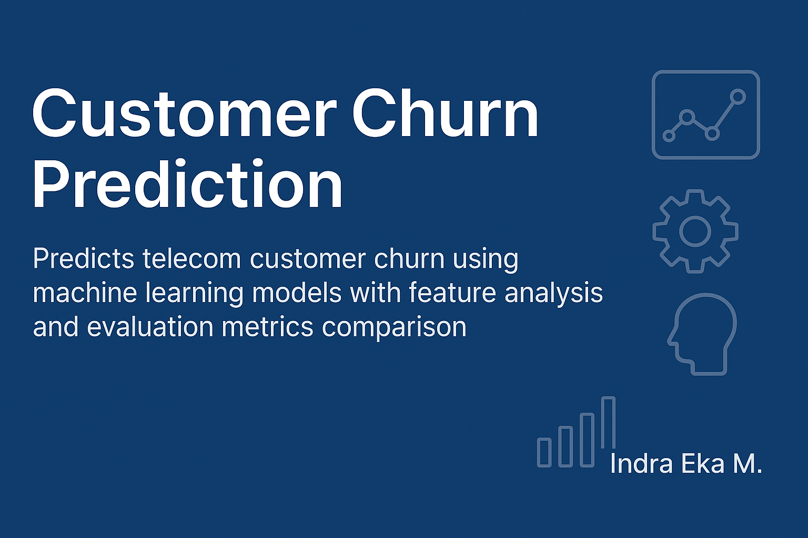

# 📉 Customer Churn Prediction using Machine Learning



This project aims to predict **customer churn** in a telecommunications company using supervised machine learning algorithms.  
It utilizes the **Telco Customer Churn dataset** and compares various classification models to identify patterns in churn behavior.

---


---

## 🎯 Objective

- Predict whether a customer is likely to churn
- Compare classification models on accuracy, recall, precision, and F1-score
- Interpret model outputs to understand key churn indicators

---

## 🔍 Workflow

1. **Load & clean data** (handle missing values, encoding, scaling)
2. **EDA**: Explore churn distribution and feature relationships
3. **Model Training**:
   - Decision Tree
   - Random Forest
   - Logistic Regression
   - KNN, SVM, MLP, Naive Bayes
   - Gradient Boost, Extra Trees, XGBoost, CatBoost
4. **Evaluation**: Use classification report, ROC-AUC, and confusion matrix

---

## 📊 Dataset

- Source: IBM Sample Dataset – Telco Customer Churn
- Features include: contract type, tenure, charges, payment method, etc.
- Target: `Churn` (Yes/No)

---

## 🚀 How to Run

1. Open `CustomerChurnAnalysis.ipynb` in Google Colab
2. Mount your Drive and upload dataset if needed
3. Run cells in order: preprocessing → training → evaluation

---

## 📂 Project Files

```
CustomerChurnAnalysis.ipynb
assets/
└── customer-churn-banner.png
data/
└── WA_Fn-UseC_-Telco-Customer-Churn.csv
```

---

## 👨‍💻 Author

**Indra Eka Mandriana S.Kom**  
_Data Scientist & AI Enthusiast in Customer Analytics_

---

## ⭐ Found this useful? Don’t forget to ⭐ the project!
